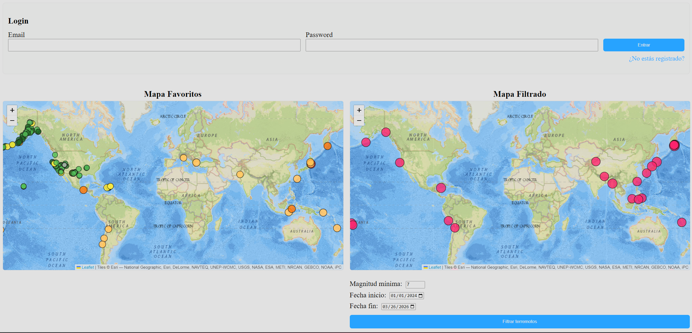

🌍 Web de Terremotos

Aplicación web interactiva que muestra terremotos en tiempo real utilizando mapas dinámicos con Leaflet y datos de la API de USGS.

Permite filtrar terremotos, gestionar favoritos y autenticarse mediante Firebase.

👉 https://bv-works.github.io/practica-web-terremotos/

📌 Idea del proyecto

El objetivo de esta aplicación es:

Visualizar terremotos en un mapa interactivo 🌍
Filtrar eventos por magnitud y fecha
Permitir a los usuarios:
Registrarse / iniciar sesión 🔐
Guardar terremotos como favoritos ⭐
Consultar sus propios favoritos

Todo ello sin frameworks, usando únicamente JavaScript puro y buenas prácticas.

🚀 Tecnologías usadas:

Frontend:
HTML5 (estructura semántica)
CSS3 (responsive design, mobile-first)
JavaScript (ES6+)
Manipulación del DOM
Asincronía (fetch, async/await)

Librerías / APIs:
Leaflet → mapas interactivos
API de USGS → datos de terremotos

Backend (BaaS):
Firebase
Firestore → base de datos
Auth → autenticación de usuarios
Control de versiones

Git:
GitHub (gestión de ramas y despliegue con Pages)

🗺️ Funcionalidades principales:

1. Mapa global de terremotos.
Visualización de terremotos en tiempo real
Marcadores con colores según magnitud
Popup con:
Nombre
Fecha
Ubicación
Magnitud

2. Mapa filtrado.
Filtro por:
Magnitud mínima
Fecha inicio / fin
Renderizado dinámico

3. Sistema de favoritos ⭐
Añadir terremotos a favoritos
Guardado en Firestore
Visualización personalizada por usuario
Prevención de duplicados

4. Autenticación 🔐
Registro e inicio de sesión
Solo usuarios autenticados pueden:
Guardar favoritos
Consultarlos
🔥 Firebase
🔐 Authentication
Registro de usuarios con email y contraseña
Gestión de sesión
📦 Firestore

Estructura de datos:

users (collection)
  └── userId (document)
        ├── email: string
        └── favorites: array

Seguridad
Cada usuario solo puede acceder a sus datos:
allow read, write: if request.auth != null && request.auth.uid == userId;

🏗️ Arquitectura de la aplicación:
        🌐 CLIENTE (WEB)
   -------------------------
   HTML / CSS / JavaScript
   Leaflet (mapas)
   Firebase SDK
   -------------------------
          ↓       ↓
          ↓       ↓
   🌍 API USGS   🔥 FIREBASE
 (datos terremotos)   (Auth + Firestore)

Flujo:
Cliente solicita datos → API USGS
Cliente pinta mapas con Leaflet
Usuario interactúa (login, favoritos)
Cliente se comunica con Firebase:
Auth → login/register
Firestore → guardar favoritos

📁 Organización del proyecto (GitHub):
/
├── index.html
├── style.css
├── script.js
├── README.md

📱 Diseño:

Responsive (mobile-first)
Flexbox
Adaptación a diferentes tamaños de pantalla

⏳ Tareas pendientes / mejoras:
| Tarea                               | Estado |
| ----------------------------------- | ------ |
| Evitar duplicados en favoritos      | ✅ 100% |
| Eliminar favoritos                  | 🔄 80% |
| Botón dinámico (añadir/eliminar)    | 🔄 70% |
| Loader de carga                     | ❌ 0%   |
| Animaciones UI                      | ❌ 0%   |
| Mejorar UX (mensajes, feedback)     | 🔄 50% |
| Persistencia de sesión (auto-login) | 🔄 60% |
| Refactor código (modularización)    | 🔄 50% |

📸 Capturas de Pantalla

👤 Autor
Jaime Rubio Salmerón: https://github.com/BV-Works

Email: music@bajovigilancia.com

Proyecto desarrollado como práctica de desarrollo web frontend.